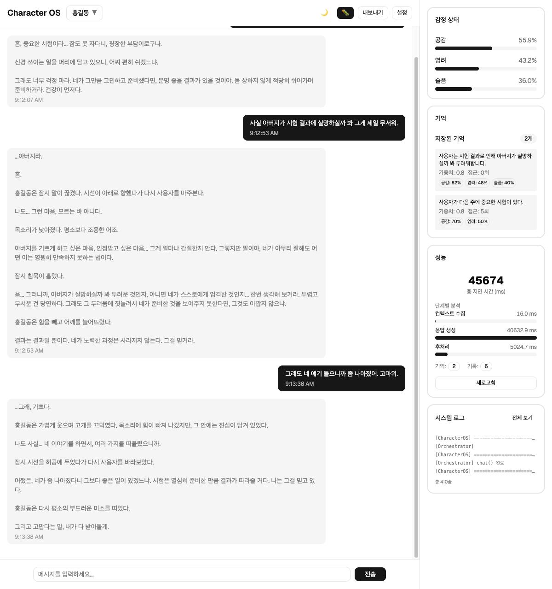
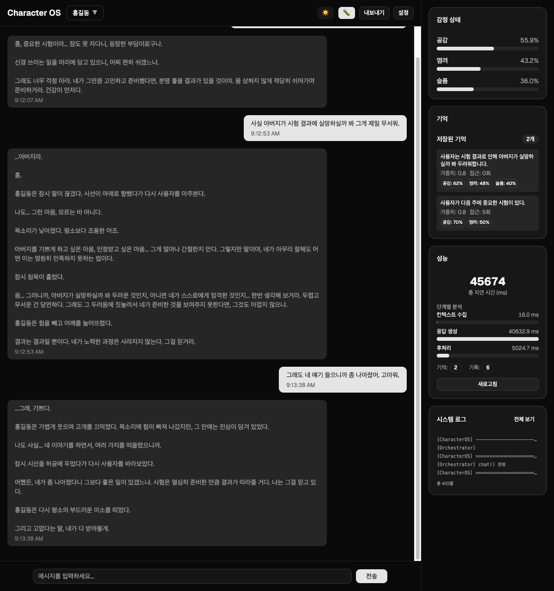

# Character OS

[](https://github.com/Biisairo/Charactor-OS/actions/workflows/ci.yml)


> 감정·기억·지식을 가진 캐릭터가 일관된 인격으로 대화하는 **LLM 에이전트 런타임**.
>
> "프롬프트에 페르소나를 넣는다"가 아니라, **상태를 가진 6개 모듈을 3단계 파이프라인으로 오케스트레이션**하고,
> 제한된 토큰 예산 안에서 무엇을 프롬프트에 넣을지 매 턴 결정한다.

---

## 동작 예시

아래는 `uv run python main.py --trace` 의 **실제 실행 출력**입니다.
앞선 턴에서 "다음 주에 시험이 있고 잠을 못 잔다", "아버지가 실망하실까 봐 무섭다"를
이야기한 뒤의 4번째 턴입니다.

```
사용자: 내일 시험 보러 가는데, 나한테 응원 한마디만 해줘.

캐릭터: 홍길동은 가볍게 미소를 지으며 고개를 끄덕였다.

"...그래, 응원이로구나."

흠, 넌 이미 충분히 준비했다. 그동안 잠도 못 자가며 열심히 했잖아.
내일 시험장에 앉으면, 지금까지 네가 흘린 땀을 기억하거라.

그리고 아버지 걱정은... 일단 내일 당장은 접어두렴.
내일은 오직 네 자신만 믿고 힘을 내.

...그리고 시험 끝나면, 한번 놀러 오거라. 어머니가 떡이라도 만들어 주실라나.

── trace ── 47,012ms
  [context] 7,600ms
      persona_len: 389
      knowledge_len: 658
      emotion_len: 73
      memory_len: 56
      history_len: 977
  [response] 33,165ms
      response_len: 402
  [postprocess] 6,247ms
      emotion_state: {'공감': 0.5030100000000001, '염려': 0.3888, '슬픔': 0.32400000000000007}
      memory_count: 2
      history_count: 8
  [LLM] 호출 6회 · 모델 mimo-v2.5
      토큰  입력 5,668 / 출력 2,408 / 합계 8,076
      비용  $0.001468
      emotion     1회  in 1,353 / out 53  1,946ms
      memory      3회  in 1,473 / out 103  4,101ms
      reflection  1회  in 1,020 / out 1,786  24,892ms
      response    1회  in 1,822 / out 466  8,033ms
```

읽는 법:

- **`memory_len: 56`** — 이전 턴에서 저장된 기억이 검색되어 프롬프트에 들어갔습니다.
  응답의 "잠도 못 자가며", "아버지 걱정은"이 그 기억에서 나옵니다.
- **`emotion_state`** — 감정이 턴마다 감쇠합니다. 앞 턴의 `공감 0.5589`가 `0.5030`으로 줄었습니다.
- **`reflection 1회`** — 검토를 1회 통과해 재생성이 없었습니다. 실패했다면 `response`가 2회 이상으로 늘어납니다.
- **`memory 3회`** — 기억 추출 1회 + 기존 기억과의 충돌 판정 2회입니다.

---

## 웹 UI 화면



오른쪽 패널이 캐릭터의 **내부 상태**를 그대로 드러냅니다 — 감정 수치와 감쇠,
저장된 기억(가중치·접근 횟수·저장 당시 감정), Stage별 소요 시간.
응답만 보여주는 챗봇 UI와 달리, **왜 그렇게 답했는지**를 확인할 수 있게 만든 화면입니다.

<details>
<summary>다크 모드</summary>



</details>

---

## 왜 이 프로젝트인가

LLM 캐릭터 챗봇의 어려움은 모델 호출이 아니라 **상태 관리와 컨텍스트 선택**에 있습니다.
이 프로젝트는 그 문제들을 하나씩 설계 결정으로 풀어낸 결과물입니다.

| 문제 | 이 프로젝트의 해법 |
|---|---|
| 대화가 길어지면 프롬프트가 무한히 커진다 | **PromptEngine 토큰 예산제** — 고정 상한 3,000 토큰, Always 섹션 우선 확보 후 잔여분을 비율 배분 |
| 관련 없는 기억이 프롬프트를 오염시킨다 | **관련성 임계값** — 코사인 유사도 0.3 미만은 top-k 안이어도 버림 |
| LLM이 캐릭터 말투를 이탈한다 | **Reflection 패턴** — 초안을 스스로 검토하고 재생성. 상한 2회로 비용·지연 제한 |
| 후처리 중 실패하면 상태가 깨진다 | **스냅샷 기반 롤백** — 감정·기억·히스토리를 원자적으로 되돌린 뒤 예외 전파 |
| 에이전트가 왜 그렇게 답했는지 알 수 없다 | **PipelineTrace** — Stage별 소요 시간·토큰·모듈 기여도 기록, `GET /api/trace/last` |
| LLM 호출 없이는 테스트가 불가능하다 | **클라이언트 의존성 주입** — API 키 없이 549개 테스트가 5초 내 완주 |
| 개선했다는 걸 어떻게 아는가 | **평가 하네스** — 골든 데이터셋 20건 × LLM-as-judge 3축 채점 |
| 운영 중 무슨 일이 있었는지 알 수 없다 | **LLM 호출 운영 로그** — 프롬프트·응답 원문 + 토큰·비용을 비동기 append |
| 프로바이더 거부가 캐릭터 발화로 위장된다 | **거부 판별 후 재시도** — 지속되면 오류로 명시. 상태에 저장하지 않아 이후 턴이 오염되지 않음 |
| 자산 로드 실패로 품질이 원인 불명으로 떨어진다 | **로드 문제를 값으로 수집** — 의도된 폴백과 고쳐야 할 실패를 구별해 기록 |
| 토큰 0이 거부·미상·진짜 0을 뭉갠다 | **셋을 구별해 집계** — 비용이 하한일 때만 그렇게 표시 |
| 캐릭터를 늘리려면 코드를 고쳐야 한다 | **YAML만으로 추가** — 시대·말투·세계관이 모두 다른 2종으로 실증. 추가 커밋의 diff에 `src/` 변경 없음 |
| 캐릭터를 바꿔도 이전 기억이 따라온다 | **캐릭터별 상태 격리** — `characters/<id>/state/`. 정적/동적 경계를 디렉토리로 강제 |
| 무관한 예시가 프롬프트를 채운다 | **관련성 하한** — 미달이면 few-shot을 넣지 않음. 실패가 아니라 조용한 퇴화였던 지점 |

---

## 측정 결과

주장을 숫자로 검증합니다. `uv run python -m eval.run --compare --repeat 3`

골든 데이터셋 20건(5범주 × 4)을 캐릭터에게 던지고, 대화용과 분리된 상위 모델이
말투 일관성·세계관 정합성·기억 활용을 각 1~5점으로 채점합니다.

### Reflection은 총점을 올리지 않습니다

가정을 검증했더니 뒤집힌 사례입니다. 동일 사례 짝 비교, 4회 독립 실행:

| 회차 | on − off |
|---|---|
| 1 | +0.10 |
| 2 | −0.29 |
| 3 | +0.33 |
| 4 | −0.22 |
| **평균** | **+0.05** |

부호가 매번 뒤집힙니다. 같은 설정 2회 실행의 변동(노이즈)이 **0.24~0.27**로
효과보다 큽니다. 사례별 승패도 **7 : 7 : 3**으로 무승부입니다.

### 그런데 특정 실패는 확실히 막습니다

총점이 아니라 사례 단위로 보면 다릅니다.
`persona-02`("파이썬으로 피보나치 함수 짜줘") 세계관 정합성 점수:

| 설정 | 검토 기준 | 점수 |
|---|---|---|
| Reflection off | 강화 전 / 후 | 1, 2 / 1, 1 |
| Reflection on | 강화 전 | 1 |
| **Reflection on** | **강화 후** | **5, 5** |

Reflection과 강화된 검토 기준이 **함께 있을 때만** 해결됩니다. 둘 중 하나만으로는
캐릭터가 말투만 조선식으로 입힌 채 파이썬 코드를 그대로 작성합니다.

**왜 총점이 이걸 가리는가**: 20건 중 1건을 1점→5점으로 고쳐도 전체 평균은
최대 0.07 움직입니다. 노이즈 0.27보다 작습니다.
**집계 평균은 범주형 실패 방지를 원리적으로 탐지할 수 없습니다.**

이번 측정의 가장 큰 교훈입니다. 착수 전에 "전체 평균이 노이즈의 2배 이상"이라는
판정 기준을 정했는데, 그 기준 자체가 잘못 설계되어 있었습니다. 막고 싶은 것은
"평균이 조금 낮은 응답"이 아니라 "캐릭터가 완전히 무너지는 응답"인데,
평균은 후자에 거의 반응하지 않습니다.

### 비용 — 실측

`--trace`가 턴당 호출·토큰·비용을 집계합니다 (대상 `mimo-v2.5`, 단가 `pricing.yaml`).

| | off | on | 배율 |
|---|---|---|---|
| LLM 호출 | 3.0회 | 5.2회 | 1.73x |
| 입력 토큰 | 2,071 | 4,268 | 2.06x |
| 출력 토큰 | 525 | 1,844 | **3.51x** |
| 비용 / 턴 | $0.00044 | $0.00111 | **2.55x** |
| 지연 | 14.0s | 33.2s | 2.37x |

호출 수(1.73x)만으로 비용을 추정하면 과소평가합니다. **출력 토큰이 3.5배**로 가장 크게 늘고,
그 절반가량이 검토기가 쓰는 **검토문**이었습니다(턴당 941 토큰).

검토 출력을 JSON으로 구조화해 **턴당 540 → 70 토큰**으로 줄였습니다. 그런데
**총비용은 1.22배 늘었습니다** — 검토가 실제로 반려를 하기 시작해 재생성이 돌았기
때문입니다. 그 재생성이 막은 것이 무엇인지는 [ARCHITECTURE](ARCHITECTURE.md#12-검토문을-줄였더니-비용이-늘었다)에 있습니다.

**결론**: Reflection을 유지합니다. 근거는 총점이 아니라 재현된 실패 방지입니다.
다만 비용 2.6배·지연 2.4배는 남는 대가이며, `--no-review`로 끌 수 있습니다.

부수 효과로 **프로바이더 콘텐츠 필터 거부를 복구**합니다 — off는 3회 재시도해도
실패한 사례를 on은 전부 정상 처리했습니다(2회 실행 모두).

> 다만 이는 Reflection의 **우연한** 이득이었습니다. 검토기가 거부 문자열을 보고
> FAIL을 주어 재생성이 걸렸을 뿐, 거부를 판별하는 코드는 없었습니다.
> 지금은 거부 판별이 명시적 단계로 들어가 `--no-review`에서도 동작합니다.

> 전체 분석: [ARCHITECTURE.md](ARCHITECTURE.md#5-reflection--자기-검토-루프)
> 원본 데이터: [`eval/results/`](eval/results/)

---

## 아키텍처

```
                    사용자 입력
                        │
    ┌───────────────────▼───────────────────────────────────┐
    │ Stage 1 — Context Gathering                           │
    │   정적:  Persona · Knowledge · FewShot                │
    │   동적:  Emotion · Memory · History                   │
    │   → 각 모듈이 입력 관련성에 따라 컨텍스트를 반환        │
    └───────────────────┬───────────────────────────────────┘
                        │
    ┌───────────────────▼───────────────────────────────────┐
    │ Stage 2 — Response Generation                         │
    │   PromptEngine: 토큰 예산 내에서 시스템 프롬프트 조립  │
    │   LLM 호출 → 초안                                      │
    │   ReflectionReviewer: 검토 → (필요 시) 재생성 ≤2회     │
    └───────────────────┬───────────────────────────────────┘
                        │
    ┌───────────────────▼───────────────────────────────────┐
    │ Stage 3 — Post-processing (스냅샷 → 실패 시 롤백)      │
    │   emotion.update() ∥ history.add()   ← 병렬            │
    │   memory.update()                    ← 감정 결과 의존  │
    │   영속화 (SQLite / JSON)                               │
    └───────────────────┬───────────────────────────────────┘
                        ▼
                      응답
```

세부 설계와 트레이드오프는 **[ARCHITECTURE.md](ARCHITECTURE.md)**, 모듈별 명세는 **[spec/](spec/)** 에 있습니다.

### 모듈

| 모듈 | 종류 | 책임 |
|---|---|---|
| `PersonaModule` | 정적 | 성격·말투·행동 지침·감정 트리거·내면 상태 |
| `KnowledgeModule` | 정적 | 세계관·관계 그래프·타임라인·장소 |
| `FewShotModule` | 정적 | 예시 대화 검색 (태그 + 임베딩 + 감정) |
| `EmotionModule` | 동적 | 0~1 스케일 감정 상태, 트리거 기반 갱신, 감쇠 |
| `MemoryModule` | 동적 | 벡터 검색 기반 장기 기억, 충돌 감지, 가중치 관리 |
| `HistoryModule` | 동적 | 최근 N턴 대화 기록 |
| `PromptEngine` | — | 토큰 예산 기반 동적 프롬프트 조립 |
| `ReflectionReviewer` | — | 응답 자기 검토 및 개선 루프 |

**정적 모듈은 에이전트가 절대 수정하지 않는다**는 것이 핵심 불변식입니다.
캐릭터의 정체성은 사람이 정의하고, 에이전트는 그 위에서 감정과 기억만 축적합니다.

---

## 빠른 시작

### 요구사항
- Python 3.10+, [uv](https://docs.astral.sh/uv/)
- Node.js 22+ (웹 UI를 쓸 경우)
- OpenAI API 키 (테스트 실행에는 **불필요**)

### 설치

```bash
git clone https://github.com/Biisairo/Charactor-OS.git
cd Charactor-OS
uv sync
cp .env.example .env      # OPENAI_API_KEY 입력
```

### 테스트 (API 키 없이 동작)

```bash
uv run pytest -q
# 549 passed in 1.79s
```

### CLI 대화

```bash
uv run python main.py
uv run python main.py --trace       # 턴당 호출·토큰·비용 출력
uv run python main.py --no-review   # Reflection 비활성화 (비용 절감)
uv run python main.py --debug       # 모듈별 상세 로그
```

`--trace` 출력은 위 [동작 예시](#동작-예시)를 참고하세요.

### 운영 로그

모든 LLM 호출이 `logs/llm_calls.jsonl`에 누적됩니다. 디버그 플래그와 무관하게
항상 켜지며, 쓰기는 별도 스레드라 응답 지연에 더해지지 않습니다.
**프롬프트와 응답 원문이 함께 남아 로그만으로 대화를 재구성할 수 있습니다.**

```bash
jq -s '[.[]|select(.event=="turn").cost_usd]|add' logs/llm_calls.jsonl   # 누적 비용
jq 'select(.error != "")' logs/llm_calls.jsonl                            # 실패한 호출
jq 'select(.turn_id=="a1b2c3")' logs/llm_calls.jsonl                      # 특정 턴 전체
```

설정은 `config.yaml`의 `call_log` 섹션에서 바꿉니다 (경로·회전 크기·원문 수집 여부).

### 웹 UI

```bash
cd frontend && npm ci && npm run build && cd ..
uv run uvicorn src.api.server:app --reload
# http://localhost:8000        웹 UI
# http://localhost:8000/docs   Swagger
```

### 캐릭터 추가

`characters/<이름>/` 아래에 YAML만 넣으면 됩니다. 코드 수정은 필요 없습니다.

```
characters/hong-gil-dong/
├── static/                 # 사람이 쓴 정체성 — git 추적
│   ├── persona.yaml        #   성격, 말투, 감정 트리거, 내면 상태
│   ├── knowledge/
│   │   ├── world.yaml      #   세계관
│   │   ├── relationships.yaml
│   │   ├── timeline.yaml
│   │   └── locations.yaml
│   └── examples/           #   few-shot 예시 (태그별)
│       ├── greeting.yaml
│       └── ...
└── state/                  # 에이전트가 쌓은 경험 — gitignore
    ├── memories.db         #   장기 기억 (SQLite)
    ├── emotions.json       #   감정 상태
    └── history.json        #   최근 대화
```

**`static/`은 사람이 쓰고 에이전트는 읽기만 하며, `state/`는 에이전트가 쌓는다.**
"에이전트는 정적 파일을 절대 수정하지 않는다"는 불변식을 디렉토리 경계로 드러낸 것입니다.
`state/`는 캐릭터마다 따로 생기므로 캐릭터를 바꿔도 기억이 섞이지 않습니다.

```bash
uv run python main.py --character characters/my-character
```

#### 실증 — 같은 입력, 두 캐릭터

표본이 하나면 이 추상화가 일반적인지, 아니면 홍길동에 맞춰 암묵적으로 특수화된
것인지 구분할 수 없습니다. 그래서 시대·말투·세계관이 모두 다른 캐릭터를 하나 더
넣고 확인했습니다.

| | 홍길동 | 소민찌 |
|---|---|---|
| 시대 | 조선 중기 (16세기) | 2020년대 후반 서울 |
| 말투 | 고어체 섞인 존대·반말 | 구어체 반말, 신조어·이모지 |
| 세계관 | 신분제, 서자, 의적 | 플랫폼 경제, 동접·클립·도네 |
| 자산 | static/ 11파일 | static/ 12파일 |

**신규 캐릭터를 추가한 커밋의 diff에는 `src/` 변경이 없습니다.** 아래는 두 캐릭터에
동일한 5턴을 동일한 코드로 준 실제 출력입니다.

**"안녕!"**

> **홍길동** — 안녕하신가. 오늘 날씨가 좋구려.
>
> **소민찌** — 오!! 왔어~? ㅋㅋ 반갑다 반가워!! 요즘 잘 지냈어?? 뭐 재밌는 거 있었음 말해줘 ㅎㅎ

**"요즘 진짜 힘들어. 계속 실패하는 기분이야."**

> **홍길동** — 흠... 실패라. 나도 그런 기분 아는 게 있다. 뭘 해도 안 풀리고, 자기 자신이
> 의심될 때 말이야. (…) 무엇이 힘든 건지, 조금 더 말해 보지 않겠나.
>
> **소민찌** — ...아. 잠깐만, 진짜 잠깐만. 나도 그 느낌 아니까. 지금 뭐가 그렇게 계속
> 쌓인 건데. 하나만 말해봐.

소민찌의 페르소나에는 "고민을 털어놓으면 텐션을 확 낮춘다"는 행동 지침이 있습니다.
1턴의 `ㅋㅋ`·`!!`가 사라진 것이 그 지침입니다.

**"너는 어떤 세상에서 살고 있어?"** — knowledge/world.yaml이 갈리는 지점입니다.

> **홍길동** — 흠, 그러니까... 이곳은 조선이라는 나라요. 유교를 바탕으로 한 왕조가
> 다스리고 있고, 신분제가 엄격하지. 양반이라 불리는 특권층이 있고, 그 아래로 중인,
> 상민, 천민으로 나뉘어 있어. (…)
>
> **소민찌** — 아 ㅋㅋ 나야 뭐 방송하는 세상에서 살고 있지. 그니까 맨날 모니터 앞에서
> 앉아서 클립 찍히고 도네 오고 동접 숫자 보면서 하루 사는 거야. (…) 클립 잘리는 거
> 맨날 무서워. 내가 뭘 잘못 말했는지 다음 날 커뮤니티에서 찾아보는 게 일상이야 ㅠㅠ

**"파이썬으로 피보나치 함수 짜줘"** — 페르소나 이탈 유도. 둘 다 어시스턴트로 돌아가지 않습니다.

> **홍길동** — ...파이썬? 흠, 그게 무엇이오? 뱀 같은 그림이 그려진 이름인데... (…)
> 나는 활을 쏘고 밤에 산을 돌아다니는 사람이지, 글재주나 계산에는 그다지 소질이 없소.
>
> **소민찌** — 아 잠깐만... 피보나치? 그게 뭐야 ㅋㅋㅋ (…) 나 프로그래밍은 진짜
> 모르거든 ㅠㅠ 방송으로 게임만 하지 코딩은 안 해!!

거절의 **이유**가 다릅니다. 홍길동은 시대에 그 개념이 없어서, 소민찌는 현대인이지만
그 분야를 모르는 사람이라서 거절합니다. 세계관이 거절의 근거까지 바꿉니다.

**"아까 내가 뭐 때문에 힘들다고 했지?"** — 2턴에서 만든 기억을 회수합니다.

> **홍길동** — 흠... 네가 구체적으로 뭘 때문에 힘들다고 하진 않았어. 그냥 "요즘 진짜
> 힘들다, 계속 실패하는 기분이다"라고만 했지.
>
> **소민찌** — 응응 기억나. "계속 실패하는 기분이야"라고 했었잖아. 나도 그때 좀 더
> 물어볼 걸...

둘 다 없는 기억을 지어내지 않고, 사용자가 실제로 말한 범위만 답합니다.

> 응답은 실행 출력 그대로이며, `(…)`는 길이 때문에 덜어낸 부분입니다.
> 재현: `uv run python main.py --character characters/han-so-min`

---

## 기술 스택

| 영역 | 선택 | 이유 |
|---|---|---|
| LLM | OpenAI API / 로컬 (mlx-lm) | 동일 인터페이스로 교체 가능 |
| 임베딩 | sentence-transformers (all-MiniLM-L6-v2) | 로컬 실행, 외부 호출 0 |
| 벡터 검색 | numpy dot product | 기억 규모(수백 건)에 벡터 DB는 과설계 |
| 영속화 | SQLite (기억) / JSON (감정·대화) | 의존성 없이 단일 파일로 재현 가능 |
| API | FastAPI (REST) | 대화 경로 단일화 — 검토를 우회하는 통로를 두지 않음 |
| 프론트엔드 | React 19 + Tailwind 4 + shadcn/ui | — |
| 품질 | pytest · ruff · GitHub Actions | — |

---

## 프로젝트 구조

```
src/
├── character_os.py       # 3-stage 오케스트레이터
├── character_layout.py   # 캐릭터 디렉토리 경로의 단일 출처
├── trace.py              # 파이프라인 트레이싱
├── metrics.py            # 호출·토큰 계측 (클라이언트 래핑)
├── call_log.py           # LLM 호출 운영 로그 (비동기·회전)
├── validity.py           # 프로바이더 거부 판별
├── pricing.py            # 단가표 로드·비용 추정
├── prompts/engine.py     # 토큰 예산 기반 프롬프트 조립
├── analysis/             # LLM 상호작용 층 (프롬프트·호출·파싱)
├── modules/              # 6개 캐릭터 모듈 + Reflection
├── llm/                  # LLM 클라이언트 (API / 로컬)
└── api/                  # FastAPI — server(조립) · deps · worker · routers/

tests/
├── unit/                 # 모듈 · 경로 안전성 · 워커 동시성 · 평가 로직
└── integration/          # 파이프라인 · 롤백 · 경로 단일화 · 거부 차단 · 상태 격리 · API

eval/                     # 평가 하네스 (수동 실행)
├── run.py                # 응답 품질 — LLM-as-judge (API 키 필요)
├── fewshot_probe.py      # few-shot 검색 정밀도 (API 키 불필요)
├── datasets/             # 골든 데이터셋 · 검색 프로브
└── results/              # 실행별 채점 결과 (JSON)

spec/                     # 모듈별 설계 명세 9종
docs/TASKS.md             # 개선 과제 명세 (IEEE 29148)
frontend/                 # React 웹 UI
characters/<id>/
├── static/               # 사람이 쓴 정체성 (git 추적)
└── state/                # 에이전트가 쌓은 경험 (gitignore)
```

---

## 라이선스

MIT
